## Vehicle Detection And Tracking
#### Udacity SDCND
---

**Vehicle Detection Project**

The goals / steps of this project are the following:

* Perform a Histogram of Oriented Gradients (HOG) feature extraction on a labeled training set of images and train a classifier Linear SVM classifier
* Optionally, you can also apply a color transform and append binned color features, as well as histograms of color, to your HOG feature vector. 
* Note: for those first two steps don't forget to normalize your features and randomize a selection for training and testing.
* Implement a sliding-window technique and use your trained classifier to search for vehicles in images.
* Run your pipeline on a video stream (start with the test_video.mp4 and later implement on full project_video.mp4) and create a heat map of recurring detections frame by frame to reject outliers and follow detected vehicles.
* Estimate a bounding box for vehicles detected.

## [Rubric](https://review.udacity.com/#!/rubrics/513/view) Points
### Here I will consider the rubric points individually and describe how I addressed each point in my implementation.  

---
### Writeup / README

#### 1. Provide a Writeup / README that includes all the rubric points and how you addressed each one.  You can submit your writeup as markdown or pdf.  [Here](https://github.com/udacity/CarND-Vehicle-Detection/blob/master/writeup_template.md) is a template writeup for this project you can use as a guide and a starting point.  

You're reading it!

Before Extracting the features, it is important to consider the dataset and analyze them. For this Project I  considered labeled data for [vehicle](https://s3.amazonaws.com/udacity-sdc/Vehicle_Tracking/vehicles.zip) and [non-vehicle](https://s3.amazonaws.com/udacity-sdc/Vehicle_Tracking/non-vehicles.zip) examples. These example images come from a combination of the [GTI vehicle](http://www.gti.ssr.upm.es/data/Vehicle_database.html) image database, the [KITTI vision](http://www.cvlibs.net/datasets/kitti/) benchmark suite, and examples extracted from the project video itself. 

The image below the shows some random pictures of vehicles and non-vehicles from the dataset:.
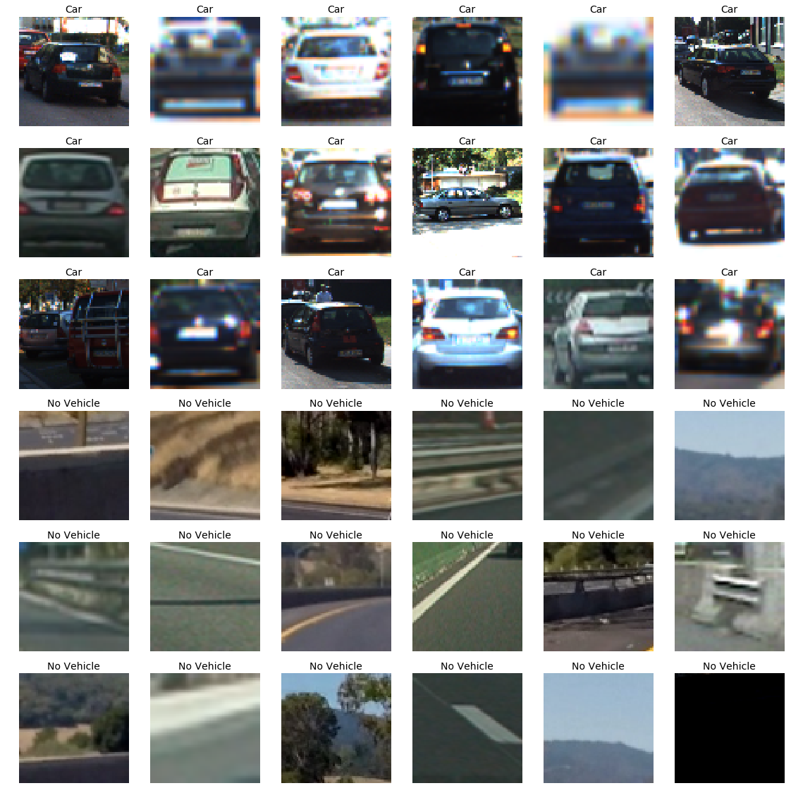

The dataset consists of 8792 pictures of vehicles and 8968 pictures of on-vehicles. 

Had it been a Deep Learning project I would have tried training the classifier on the image dataset directly, since Convolutional neural Network (CNN) have been shown to be able to extract out features directly from the images, but here in the project we are supposed to explore other classifiers, specifically classifiers based on Support Vector Machine (SVM) or decision trees (DT), so it becomes important to explore different features and use a combination of them for the classifier. As suggested in the lectures I explored for different color spaces folowing features:

* __HOG__: Histogram of gradients for different channels. 
* __Spatial Information__: The spatial information in the three channels.
* __Colour Histogram__: The spatial colour information in this case is converted to histograms.

### Histogram of Oriented Gradients (HOG)

#### 1. Explain how (and identify where in your code) you extracted HOG features from the training images.

I used the Scikit `hog` function to find the Hog features. The code for this step is defined in the function 'get_hog_features` contained in the fourth code cell of the IPython notebook.    

I explored different color spaces and different `skimage.hog()` parameters (`orientations`, `pixels_per_cell`, and `cells_per_block`).  I grabbed random images from each of the two classes and displayed them to get a feel for what the `skimage.hog()` output looks like.

Here is an example using the `YCrCb` and `RGB` color space and HOG parameters of `orientations=9`, `pixels_per_cell=(8, 8)` and `cells_per_block=(2, 2)`, also included are the bin spatial and and histograms.

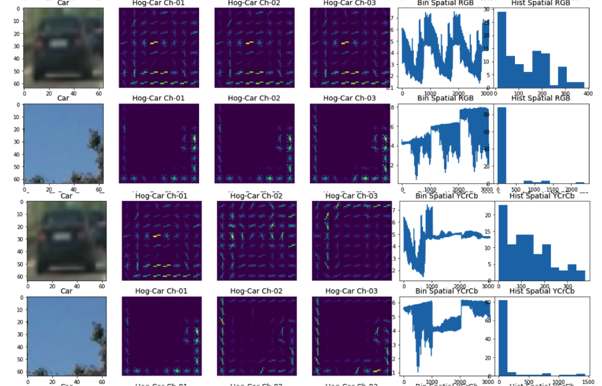

All the extracted features were also Normalized using Scikit Learn `MinMaxScaler`. 
#### 2. Explain how you settled on your final choice of HOG parameters.

I tried various combinations of parameters and colour spaces, as shown above I observed that HOG features contain more information in the three channels for YCrCb color space. So I decided to choose YCrCb color space. I experimented with different orientations and pixels_per_cell, increasing the orientation while increased accuracy but at same time due to a big feature vector also caused more training and prediction time. I had to choose an optimum, after certain experimentation, I settled for:

| Parameters | Values|
|:---:|:---:|
|Orientations |9 |
| Color Space| YCrCb|
|Pixels Per Cell| (8,8)|
|Cells Per Block| (2,2)|

This resulted in a feature vector of size 6156, took 363.88s and yielded an accuracy of 99.03% 

#### 3. Describe how (and identify where in your code) you trained a classifier using your selected HOG features (and color features if you used them).

For training: 
* I used all the three channels of YCrCb color space, the spatial bin and histogram, using `extract_features` function defined in cell 4.
* To augment the dataset  I used  flip images as well. this resulted in Car Samples of 17584 and Not Car samples of 17936.
* The dataset was split in to Train (80%) and Test (20%) data. 
* Finally, I trained a linear SVM using with squared hinge loss.

### Sliding Window Search

#### 1. Describe how (and identify where in your code) you implemented a sliding window search.  How did you decide what scales to search and how much to overlap windows?

Initially I decided to search in front range i.e Xstart = 0, Xstop = 1280,  Ystart = 390 and Ystop = 600. In this range I searched in a window size of 128 x 128, with an overlap of 75% between consecutive windows (both horizontally and vertically). The `sliding window` function and `Search window` Function were made with the help of class codes and are defined in cell 9. The `search window` takes one image at a time, so I needed to define a function which can extract the features from one image at a time. It was important that the features extracted by this function and the features on which the `LINEAR SVC` was trained should be same (The verification is shown in the output of cell 10). 

I tested the sliding window and search on the test images, you can see the result below, as can be seen, while this worked well on near large car objects, it was not so good on far small cars.

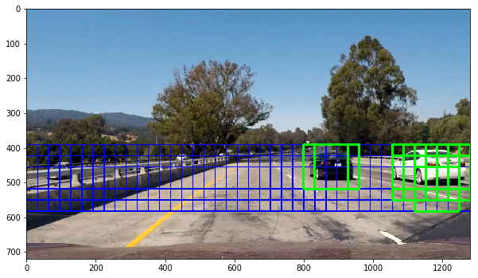 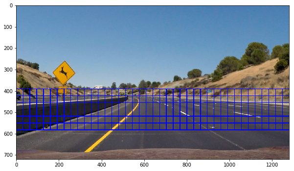
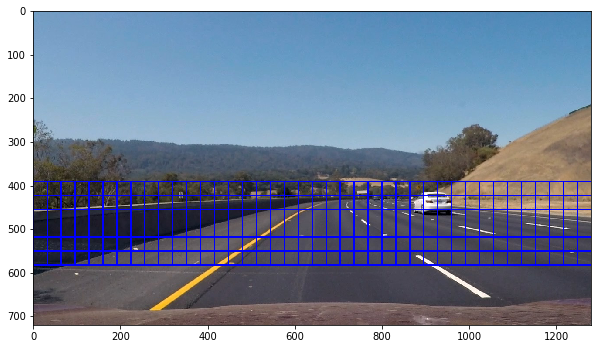 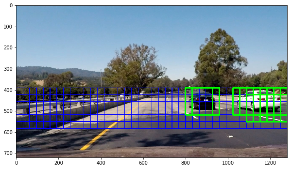
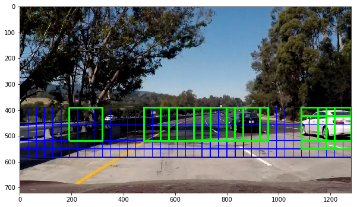 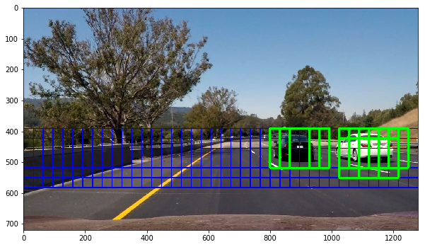

So to detect the small cars in the far region I modified the slide window range. I divided it into three distinct regions.
* The Left near region X:(930, 1280), Y: (400, 650) with window size 128x128
* The Right near region X:(0, 350), Y: (400, 650) with window size 128x128
* The front center region X:(350, 1000), Y: (400, 510) with window size 60x60.

The image below shows the three regions (blue boxes) and the searched cars in it (Green boxes) 
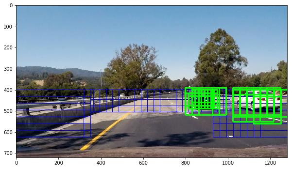

#### 2. Show some examples of test images to demonstrate how your pipeline is working.  What did you do to optimize the performance of your classifier?

Ultimately I searched on two scales for "left and right" regions and one scale for center region using YCrCb 3-channel HOG features plus spatially binned color and histograms of color in the feature vector, which provided a nice result. The complete pipeline is defined in the function `find_cars` defined in cell 13. You can see the result in image below.

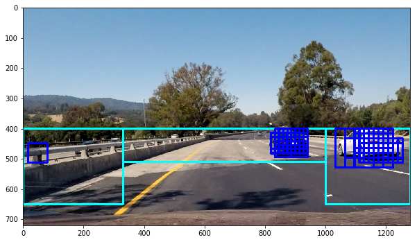 

The results now while good in detecting, still had certain **False Positives** to resolve this I used the `add_heat` function and apply threshold gunction to generate a heat map of positive predictions. Later using the Scikit `Label` function I generated a single box around the detected cars.  The result is shown in next section. 
---

### Video Implementation

#### 1. Provide a link to your final video output.  Your pipeline should perform reasonably well on the entire project video (somewhat wobbly or unstable bounding boxes are ok as long as you are identifying the vehicles most of the time with minimal false positives.)
The pipeline (defined in cell 24) was appilied to test video here's a [link to my video result](./test_video_output_YCrCb.mp4)

I also attempted to keep a record of previous detected boxes using class `Vehicle_detection`. The result of the complete pipeline (Cell 28 function `process_video`) is [Link](./test_video_output_YCrCb2.mp4).  And here is the complete video [Link](./project_video)

You can also visualize the videos in the follwing Youtube links:
* [Test Video Primitive Pipeline](https://www.youtube.com/watch?v=snl0Uoep89c)
* [Test Video Pipeline with previous frame memory](https://www.youtube.com/watch?v=K8Tsb9EsoVk)
* [Project Video pipeline with previous frame memory](https://www.youtube.com/watch?v=YjW2lNII3ME)

#### 2. Describe how (and identify where in your code) you implemented some kind of filter for false positives and some method for combining overlapping bounding boxes.

I recorded the positions of positive detections in each frame of the video.  From the positive detections I created a heatmap and then thresholded that map to identify vehicle positions.  I then used `scipy.ndimage.measurements.label()` to identify individual blobs in the heatmap.  I then assumed each blob corresponded to a vehicle.  I constructed bounding boxes to cover the area of each blob detected.

### Here are six frames and their corresponding heatmaps, along with the output of `scipy.ndimage.measurements.label()` on the integrated heatmap and resulting bounding boxes on all six test frames :

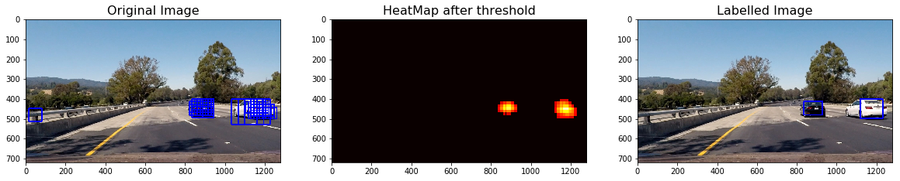

---

### Discussion

#### 1. Briefly discuss any problems / issues you faced in your implementation of this project.  Where will your pipeline likely fail?  What could you do to make it more robust?

Here I'll talk about the approach I took, what techniques I used, what worked and why, where the pipeline might fail and how I might improve it if I were going to pursue this project further.  
* `LUV` and `YCRCb` color spaces gave good result. But LUV was not working on an image with lot of shadows. It generated large number of False positives in shadowed regions. YCrCb color space worked comparitively better. 
* The optimization of window search region and scale took lot of time. The present selections work sufficient on the provided test images and videos. 
* The dark regions still result in false positive sometimes, the reason probably being that the current dataset has lot of dark colored cars.

To make it more robust:
* I would extract the features using CNN layers in the starting. 
* I augmented the data with flipped images. I can also augment the data with brightness augmented images.

